---

# HEALTHGUARD - HỆ THỐNG TRỢ LÝ SỨC KHỎE THÔNG MINH TÍCH HỢP AI

## 1. Tên đề tài

**HealthGuard**: Ứng dụng di động hỗ trợ chẩn đoán bệnh lý lâm sàng và quản lý sức khỏe cá nhân tích hợp trí tuệ nhân tạo.

## 2. Giới thiệu hệ thống

HealthGuard là giải pháp y tế số giúp kết nối người dùng với các công cụ phân tích sức khỏe hiện đại:

* **Chẩn đoán AI:** Sử dụng thuật toán Logistic Regression để phân tích triệu chứng và đưa ra xác suất mắc bệnh.
* **Hồ sơ sức khỏe:** Lưu trữ tập trung thông tin cá nhân, chỉ số BMI, nhóm máu và tiền sử bệnh lý.
* **Lịch sử chẩn đoán:** Ghi nhận và lưu trữ chi tiết các lần kiểm tra để theo dõi diễn biến sức khỏe.

## 3. Danh sách thành viên và Phân công nhiệm vụ

*Dự án được phân chia công việc đồng đều, trong đó cả 3 thành viên đều tham gia trực tiếp vào việc phát triển ứng dụng Mobile (React Native).*

| STT | Họ và Tên | MSSV | Vai trò | Nhiệm vụ cụ thể trong dự án |
|:---:|:---|:---:|:---:|:---|
| 1 | **Đỗ Gia Nam** | **23810310245** | **Team Leader / Backend & Mobile Integration** | - Xây dựng Backend API (C#) và Model AI (Python).<br>- Thiết lập kiến trúc State Management bằng `Context API` (`AuthContext.js`) trên Mobile.<br>- Cấu hình kết nối API (Fetch), Dev Tunnels và xử lý luồng nhận mã OTP tự động trên App. |
| 2 | **Bùi Đình Hiếu** | **23810310246** | **Mobile Developer (Core Features)** | - Thiết lập luồng điều hướng chuyển trang (`React Navigation`).<br>- Xây dựng UI và Logic cho các màn hình cốt lõi: Trang chủ (Dashboard) và Chẩn đoán AI.<br>- Viết các `Custom Hooks` (`useDiagnosisData`, `useHomeData`) để xử lý dữ liệu. |
| 3 | **Nguyễn Thế Hiệp** | **23810310252**| **Mobile Developer (User & Storage) / AI** | - Phát triển phân hệ người dùng: Lịch sử chẩn đoán và Cập nhật hồ sơ.<br>- Xử lý kỹ thuật lưu trữ cục bộ (Caching) hình ảnh/dữ liệu bằng `AsyncStorage` và thư viện `expo-image-picker`.<br>- Phát triển và huấn luyện mô hình AI chẩn đoán bệnh bằng Python (Logistic Regression, Flask API). |

## 4. Công nghệ sử dụng

* **Mobile:** React Native (Expo), Lucide Icons.
* **Backend:** ASP.NET Core 8.0, Entity Framework Core.
* **AI:** Python, Scikit-learn, Flask.
* **Kết nối:** Dev Tunnels (Microsoft).

## 5. Hướng dẫn cài đặt chi tiết

### Bước 1: Chuẩn bị môi trường AI (Python)

*Link Git AI: https://github.com/dgnaw/HealthGuard_AI.git*

1. Cài đặt Python 3.9 trở lên.
2. Mở Terminal tại thư mục AI và chạy lệnh: `pip install pandas scikit-learn joblib flask flask-cors`.
3. Khởi chạy server AI: `python app.py`.
* *Mục tiêu:* Server sẽ chạy tại `http://127.0.0.1:5000`.


### Bước 2: Thiết lập Backend (C#)

*Link Git Backend: https://github.com/Hueiboi/HealthGuard.git*

1. Mở project bằng **Visual Studio 2022**.
2. Kiểm tra và cập nhật `appsettings.json` để kết nối với Database của bạn.
3. Chạy lệnh `Update-Database` trong *Package Manager Console* để khởi tạo dữ liệu.

### Bước 3: Cấu hình Frontend (React Native)

*Link Git Frontend: https://github.com/Hueiboi/HealthGuard_Mobile.git*

1. Cài đặt Node.js và chạy lệnh `npm install` tại thư mục Frontend.
2. Mở file `config/api.js` để chuẩn bị cấu hình link API.

---

## 6. Hướng dẫn chạy Project (Từng bước)

Để hệ thống hoạt động hoàn hảo, vui lòng thực hiện đúng theo các bước sau:

**BƯỚC 1: Kích hoạt đường truyền Dev Tunnel**

1. Tại Visual Studio (Backend), nhấn vào mũi tên cạnh nút **Start**, chọn **Dev Tunnels** > **Create A Tunnel**.
2. Thiết lập: Name: `HealthGuard`, Tunnel Type: `Public`.
3. Nhấn **Run** dự án Backend. Một trang web sẽ hiện ra trên trình duyệt, hãy **copy đường dẫn URL https** (ví dụ: `https://xxxx-5297.asse.devtunnels.ms`).

**BƯỚC 2: Kết nối Mobile với Backend**

1. Mở file `config/api.js` trong thư mục Frontend.
2. Dán đường dẫn Tunnel vừa copy vào biến `API_BASE_URL`:
```javascript
export const API_BASE_URL = `https://link-tunnel-cua-ban.asse.devtunnels.ms`;

```


3. Lưu file và chạy lệnh: `npx expo start --tunnel` tại terminal của Frontend.

**BƯỚC 3: Khởi động App và Đăng nhập**

1. Sử dụng ứng dụng **Expo Go** trên điện thoại để quét mã QR vừa hiện ra.
2. Tại màn hình Đăng nhập, nhập số điện thoại của bạn và nhấn **Gửi mã OTP**.
3. **Cơ chế nhận OTP:** Sau khi nhấn gửi, hãy chờ khoảng 3 giây (độ trễ mô phỏng tin nhắn SMS), một thông báo popup sẽ tự động hiện lên trên màn hình điện thoại chứa mã xác thực.
4. Nhập mã OTP đó vào App để bắt đầu trải nghiệm các tính năng chẩn đoán AI.

---

## 7. Hình ảnh minh họa & Demo

### Giao diện hệ thống

#### A. Phân hệ Đăng nhập & Xác thực OTP
| 01. Onboarding Screen | 02. Trang Đăng ký | 03. Trang Đăng nhập | 04. Trang nhập mã OTP |
| :---: | :---: | :---: | :---: | 
| 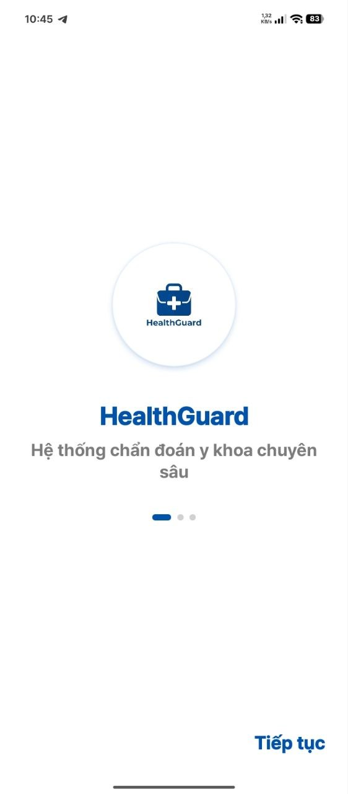 | 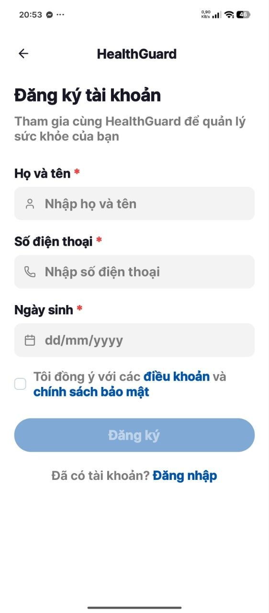 | 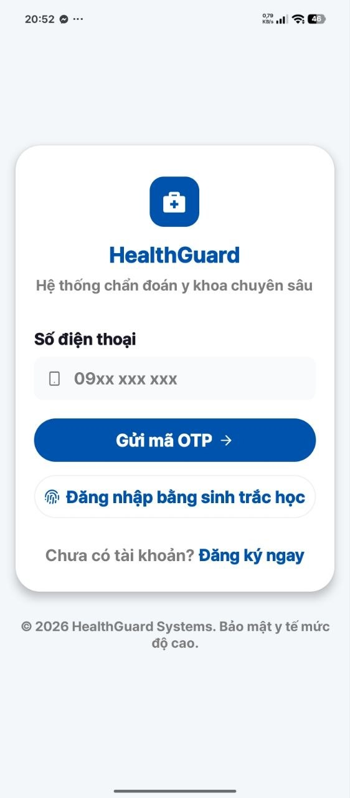 | 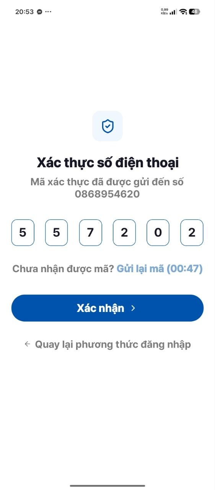 |

#### B. Phân hệ Trang chủ & Chẩn đoán AI
| 05. Trang chủ | 06. Trang Chẩn đoán bệnh | 07. Trang Xem chi tiết bệnh đã chẩn đoán | 08. Trang Lịch sử chẩn đoán | 09. Trang gửi phản hồi |
| :---: | :---: | :---: | :---: | :---: | 
| 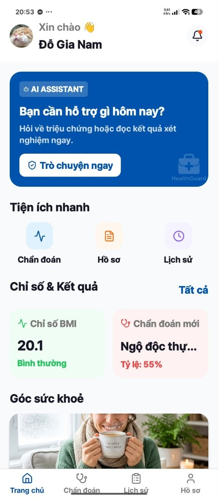 | 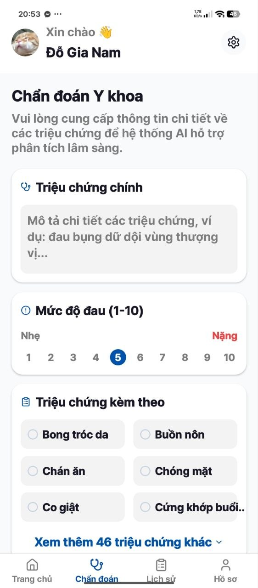 | 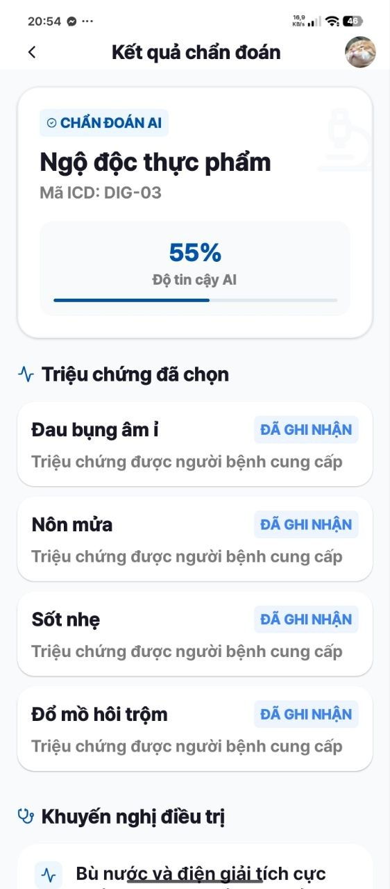 | 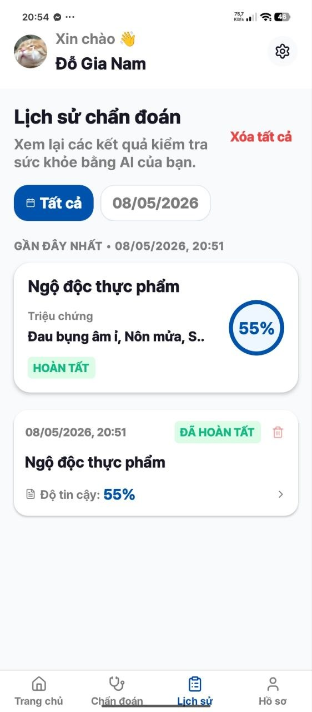 | 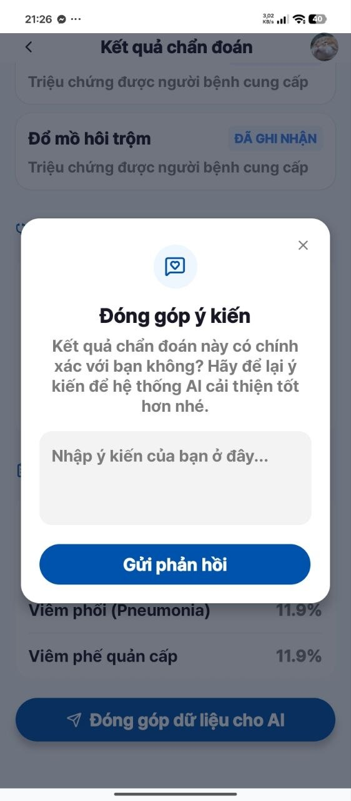 |


#### C. Phân hệ Hồ sơ bệnh nhân
| 10. Hồ sơ người dùng | 11. Cập nhật hồ sơ sức khỏe |
| :---: | :---: |
| 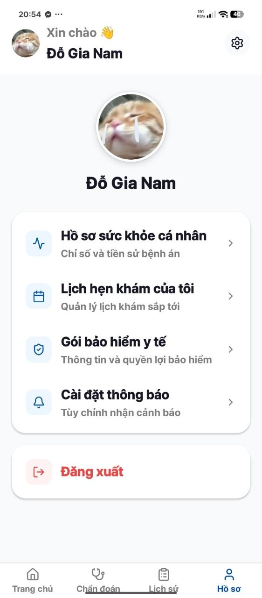 | 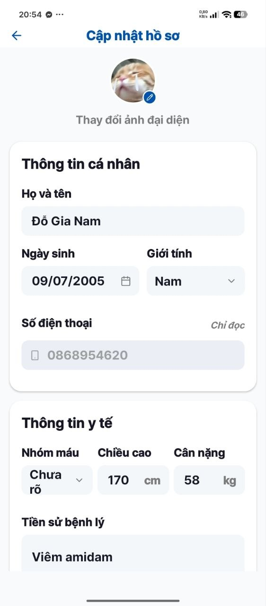 |

### Video Demo thực tế

* **Link Google Drive:** [[DemoVideo](https://drive.google.com/drive/folders/1Pxpv-xSVtrFf2e7gTLfMekfEFZfHH1F_?usp=sharing)]
* *(Video bao gồm toàn bộ quy trình từ lúc đăng nhập, nhận OTP tự động cho đến khi AI trả kết quả chẩn đoán).*

---

*Dự án được thực hiện phục vụ mục đích học tập và nghiên cứu đồ án công nghệ.*